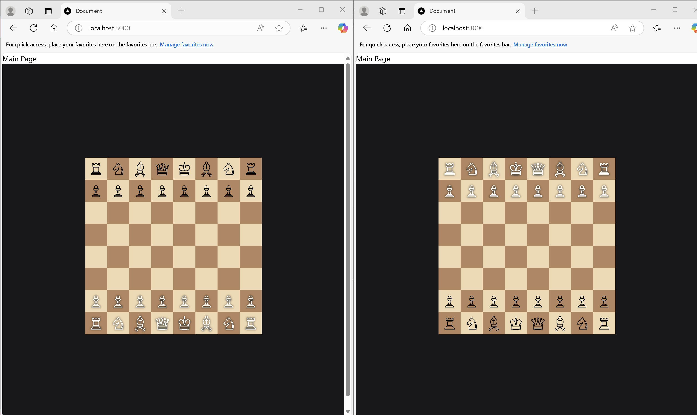
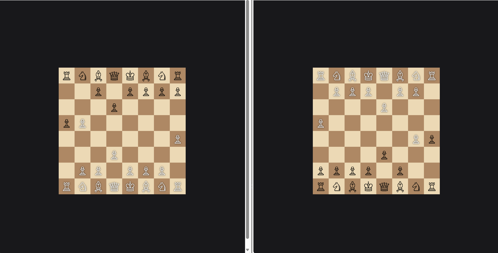

# REAL_TIME_CHESS
    This is a real time chess game made using the Chess Library. The project uses socket.io, for real-time communication between players.

# Live Link
https://real-time-chess.onrender.com/

## Installation
Clone the repository with
```bash
git clone https://github.com/rampalliprakhar/Real_Time_Chess
```

### Navigate the directory
```bash
cd Real_Time_Chess
```

### Install dependencies
```bash 
npm i
```

### Run it 
```bash  
npm run dev 
```

## Example:
### At the initial stage:

### After the player gets eliminated
